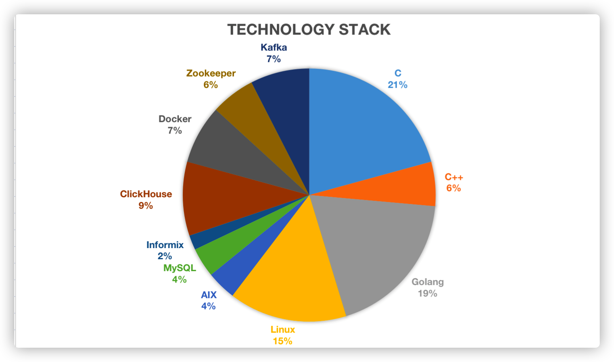

[](https://github.com/anuraghazra/github-readme-stats)


# About me

```go
package main

import "fmt"

type Myself struct {
	Name        string
	ChineseName string
	PenName     string
	Age         int
	Addr        string
	Job         string
	Company     string
}

func main() {
	myself := Myself{
		Name:        "YenchangChan",
		ChineseName: "陈衍长",
		PenName:     "禹鼎侯",
		Age:         30,
		Addr:        "Pudong,Shanghai",
		Job:         "Developer",
		Company:     "eoitek",
	}

	fmt.Printf("Introduce myself: %v\n", myself)
}
```


# Technology stack




# Hobby

-   **Write Novels**

    -   You can read my works in:
        -   [豆瓣阅读](https://read.douban.com/author/63697360/)
        -   [江山文学](http://www.vsread.com/space/myspace-25017.html)
    -   You can buy my ebooks in：
        -   [iReader](http://www.ireader.com/index.php?ca=search.index&keyword=%E7%A6%B9%E9%BC%8E%E4%BE%AF)
        -   [kindle](https://www.amazon.cn/s?k=%E7%A6%B9%E9%BC%8E%E4%BE%AF&i=digital-text&__mk_zh_CN=%E4%BA%9A%E9%A9%AC%E9%80%8A%E7%BD%91%E7%AB%99&ref=nb_sb_noss)
    -   You can buy my my entity books in:
        -   [京东商城](https://item.jd.com/12585806.html)
        -   [淘宝](https://detail.tmall.com/item.htm?spm=a220m.1000858.1000725.1.6ea85243H3ECSY&id=624846995548&user_id=2814700210&cat_id=2&is_b=1&rn=bfbb7fd682eb11d30d653d2a0eb6bd76)
        -   [当当图书](http://product.dangdang.com/1879412302.html)

    


